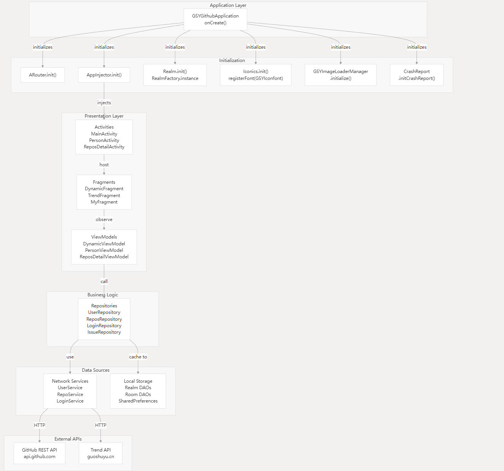
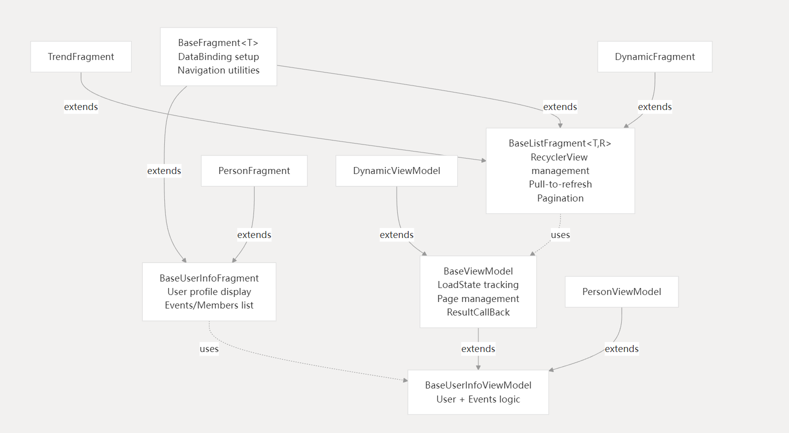
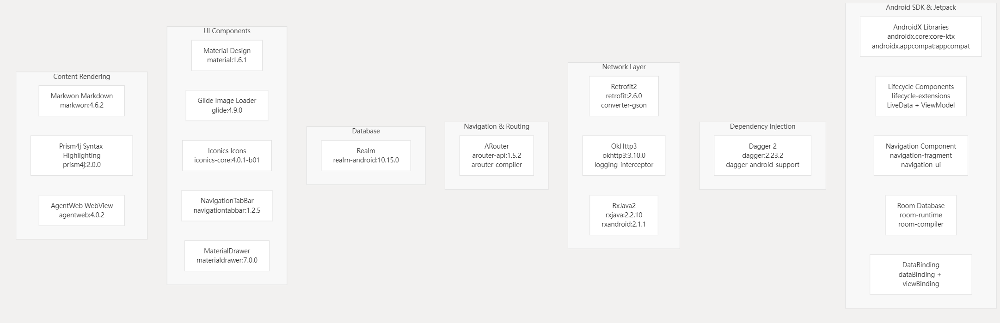
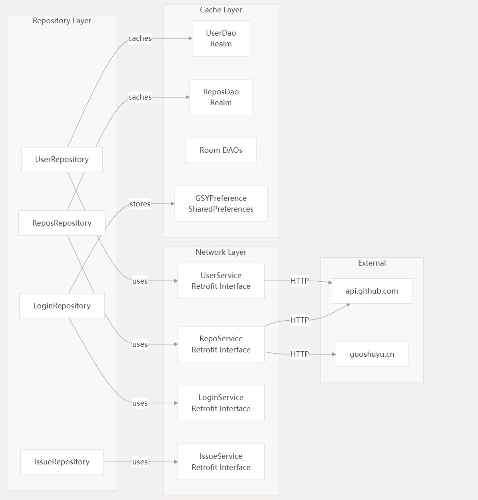
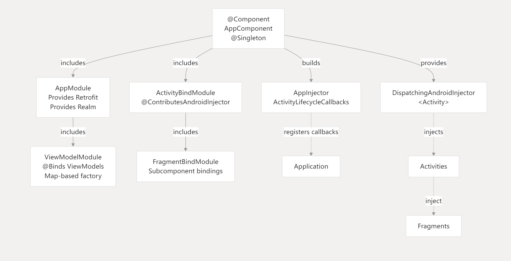

[English](README-EN.md) | [中文](README.md)


## An open source Github client App developed with native Android. It provides richer features and a better experience. It aims to better manage and maintain personal Github in daily life and provide a better and more convenient driving experience~~Σ(￣。￣ﾉ)ﾉ. The project uses `Retrofit2 + RxJava2 + Dagger2 + DataBinding + LiveData + Navigation`, etc., MVVM with Android JetPack, involving various common controls, `AIDL`, `CMake`, and provides a wealth of comparisons of the same style:

* ### Flutter version ( https://github.com/CarGuo/GSYGithubAppFlutter )
* ### Weex version ( https://github.com/CarGuo/GSYGithubAppWeex )
* ### ReactNative version ( https://github.com/CarGuo/GSYGithubApp )
* ### Android Compose version ( https://github.com/CarGuo/GSYGithubAppKotlinCompose )

* ### [If cloning is too slow or images are not loading, you can try downloading from Gitee](https://gitee.com/CarGuo/GSYGithubAppKotlin)

| Official Account | Juejin | Zhihu | CSDN | JianShu
|---|---|---|---|---|
| GSYTech | [Link](https://juejin.im/user/582aca2ba22b9d006b59ae68/posts) | [Link](https://www.zhihu.com/people/carguo) | [Link](https://blog.csdn.net/ZuoYueLiang) | [Link](https://www.jianshu.com/u/6e613846e1ea)


```
A native App developed based on Kotlin. It is currently in its initial version and is being continuously improved.

The purpose of the project is to facilitate personal daily maintenance and access to Github, to better immerse in the community of fellow developers. Github is your home.

The project is also suitable for practicing and learning Android and Kotlin, covering the use of various frameworks.

With the use and feedback of the project, the user experience and function optimization will be updated and improved from time to time. Questions are welcome.
```
-----


## Related Articles

>Stay tuned


[](https://github.com/CarGuo/GSYGithubAppKotlin/actions)
[](https://github.com/CarGuo/GSYGithubAppKotlin/stargazers)
[](https://github.com/CarGuo/GSYGithubAppKotlin/network)
[](https://github.com/CarGuo/GSYGithubAppKotlin/issues)
[](https://github.com/CarGuo/GSYGithubAppKotlin/blob/master/LICENSE)

## How to Compile and Run


> ### Important: You need to configure the `local.properties` file in the project root directory, and then enter your Github client_id and client_secret.

    ndk.dir="xxxxxxxx"
    CLIENT_ID = "xxxxxx"
    CLIENT_SECRET = "xxxxxx"
> ### If you need to test `CMake`, you need to enable `needCMakeTest` in Gradle, and remember to configure the [`CMake` environment](https://blog.csdn.net/laibowon/article/details/79939962).


  [Portal to register a Github APP](https://github.com/settings/applications/new), of course, the premise is that you have a github account (～￣▽￣)～ .
 
### 3. Now the Github API requires secure login (authorized login), so the Authorization callback URL field in the Github App registration above must be filled with `gsygithubapp://authed`

<div>


</div>


## Project Structure












## Download

#### Apk Download Link: [Apk Download Link](https://github.com/CarGuo/GSYGithubAppKotlin/releases)


### FAQ


>Stay tuned


### Screenshots


### Third-party libraries

| Library | Function |
|---|---|
| **retrofit2** | **Network** |
| **okHttp3** | **Network** |
| **rxJava2** | **Asynchronous event processing** |
| **dagger2** | **Dependency Injection** |
| **dataBinding** | **Data Binding** |
| **liveData/viewModel** | **Data Subscription** |
| **navigation** | **Android JetPack Navigation** |
| **aRouter** | **Component-based routing** |
| **glide** | **Image Loading** |
| **realm** | **Database** |
| **iconics** | **Vector Icons** |
| **navigationtabbar** | **TabBar** |
| **lazyRecyclerAdapter** | **Generic binding RecyclerView adapter** |
| **markdownView** | **Markdown parsing** |
| **prism4j** | **Code highlighting** |
| **materialDrawer** | **drawer** |
| **lottie** | **svg animation** |
| **gson** | **json parsing** |

### In progress:

[Version Update Description](https://github.com/CarGuo/GSYGithubAppKotlin/blob/master/VERSION.md)


### Other recommendations

* [ThirtyDegreesRay/OpenHub](https://github.com/ThirtyDegreesRay/OpenHub) : An open source github app based on Java + Retrofit + RxJava + MVP (some data entities in this project are copied from OpenHub.)


### LICENSE
```
CarGuo/GSYGithubAppFlutter is licensed under the
Apache License 2.0

A permissive license whose main conditions require preservation of copyright and license notices.
Contributors provide an express grant of patent rights.
Licensed works, modifications, and larger works may be distributed under different terms and without source code.
```

