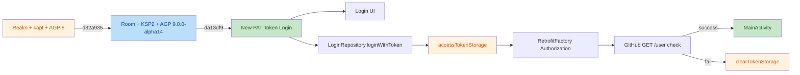

[English](README-EN.md) | [中文](README.md)


## An open source Github client App developed with native Android. It provides richer features and a better experience. It aims to better manage and maintain personal Github in daily life and provide a better and more convenient driving experience~~Σ(￣。￣ﾉ)ﾉ. The project uses `Retrofit2 + RxJava2 + Dagger2 + DataBinding + LiveData + Navigation`, etc., MVVM with Android JetPack, involving various common controls, `AIDL`, `CMake`, and provides a wealth of comparisons of the same style:

* ### Flutter version ( https://github.com/CarGuo/GSYGithubAppFlutter )
* ### Weex version ( https://github.com/CarGuo/GSYGithubAppWeex )
* ### ReactNative version ( https://github.com/CarGuo/GSYGithubApp )
* ### Android Compose version ( https://github.com/CarGuo/GSYGithubAppCompose )
* ### Compose Multiplatform version ( https://github.com/CarGuo/GSYGithubAppCMP )

* ### [If cloning is too slow or images are not loading, you can try downloading from Gitee](https://gitee.com/CarGuo/GSYGithubAppKotlin)

| Official Account | Juejin | Zhihu | CSDN | JianShu
|---|---|---|---|---|
| GSYTech | [Link](https://juejin.im/user/582aca2ba22b9d006b59ae68/posts) | [Link](https://www.zhihu.com/people/carguo) | [Link](https://blog.csdn.net/ZuoYueLiang) | [Link](https://www.jianshu.com/u/6e613846e1ea)


```
A native App developed based on Kotlin. It is currently in its initial version and is being continuously improved.

The purpose of the project is to facilitate personal daily maintenance and access to Github, to better immerse in the community of fellow developers. Github is your home.

The project is also suitable for practicing and learning Android and Kotlin, covering the use of various frameworks.

With the use and feedback of the project, the user experience and function optimization will be updated and improved from time to time. Questions are welcome.
```
-----


## Related Articles

>Stay tuned


[](https://github.com/CarGuo/GSYGithubAppKotlin/actions)
[](https://github.com/CarGuo/GSYGithubAppKotlin/stargazers)
[](https://github.com/CarGuo/GSYGithubAppKotlin/network)
[](https://github.com/CarGuo/GSYGithubAppKotlin/issues)
[](https://github.com/CarGuo/GSYGithubAppKotlin/blob/master/LICENSE)

## How to Compile and Run


> ### Important: You need to configure the `local.properties` file in the project root directory, and then enter your Github client_id and client_secret.

    ndk.dir="xxxxxxxx"
    CLIENT_ID = "xxxxxx"
    CLIENT_SECRET = "xxxxxx"
> ### If you need to test `CMake`, you need to enable `needCMakeTest` in Gradle, and remember to configure the [`CMake` environment](https://blog.csdn.net/laibowon/article/details/79939962).


  [Portal to register a Github APP](https://github.com/settings/applications/new), of course, the premise is that you have a github account (～￣▽￣)～ .
 
### 3. Now the Github API requires secure login (authorized login), so the Authorization callback URL field in the Github App registration above must be filled with `gsygithubapp://authed`

<div>


</div>

> ### 4. Besides OAuth authorization, the login page also provides a "Login with Token" entry: generate a token with `repo / user / notifications` scopes at [Github Personal Access Tokens](https://github.com/settings/tokens), then tap the "LOGIN WITH TOKEN" button on the login page and paste it to sign in. No client_id/client_secret needed.


## Project Structure


## Architecture Evolution

> The mainline has migrated from Realm to Room, from kapt to KSP2, and from AGP 8 to AGP 9, plus a new Personal Access Token login entry. The diagram below summarizes the migration and the login flow:


<details>
<summary>View Mermaid source (GitHub renders this natively)</summary>


```mermaid
flowchart LR
    A[Realm + kapt + AGP 8] -->|d32a935| B[Room + KSP2 + AGP 9.0.0-alpha14]
    B -->|da13df9| C[New PAT Token Login]
    C --> D[Login UI]
    C --> E[LoginRepository.loginWithToken]
    E --> F[accessTokenStorage]
    F --> G[RetrofitFactory Authorization]
    G --> H[GitHub GET /user check]
    H -->|success| I[MainActivity]
    H -->|fail| J[clearTokenStorage]
    style A fill:#fff3e0,color:#e65100
    style B fill:#bbdefb,color:#0d47a1
    style C fill:#c8e6c9,color:#1a5e20
    style F fill:#fff3e0,color:#e65100
    style J fill:#fff3e0,color:#e65100
    style I fill:#c8e6c9,color:#1a5e20
```

</details>

### Token Login

The "Login with Token" button on the login screen opens an input dialog: paste a GitHub Personal Access Token (recommended scopes: `repo / user / notifications / gist`) and tap OK. The token is masked by default and can be toggled with the eye icon; the in-dialog "How to create a token?" link opens the GitHub settings page with the scopes pre-selected. Tokens are only written to the local SharedPreferences and are cleared automatically if validation fails.

### Build Acceleration in China (Optional)

The repository's `settings.gradle` declares only standard Gradle repositories so that GitHub Actions / overseas networks can resolve dependencies. Gradle 9 disables a whole repository on a transient 5xx, so **do not** put aliyun mirrors back into the project script. Developers in China can add mirrors via a user-level init script:

```groovy
// ~/.gradle/init.d/repo-mirror.gradle
allprojects {
    repositories {
        maven { url "https://maven.aliyun.com/repository/public" }
        maven { url "https://maven.aliyun.com/repository/google" }
        maven { url "https://maven.aliyun.com/repository/gradle-plugin" }
    }
}
settingsEvaluated { settings ->
    settings.pluginManagement {
        repositories {
            maven { url "https://maven.aliyun.com/repository/public" }
            maven { url "https://maven.aliyun.com/repository/google" }
            maven { url "https://maven.aliyun.com/repository/gradle-plugin" }
        }
    }
}
```

## Download

#### Apk Download Link: [Apk Download Link](https://github.com/CarGuo/GSYGithubAppKotlin/releases)


### FAQ


>Stay tuned


### Screenshots


### Third-party libraries

| Library | Function |
|---|---|
| **retrofit2** | **Network** |
| **okHttp3** | **Network** |
| **rxJava2** | **Asynchronous event processing** |
| **dagger2** | **Dependency Injection** |
| **dataBinding** | **Data Binding** |
| **liveData/viewModel** | **Data Subscription** |
| **navigation** | **Android JetPack Navigation** |
| **aRouter** | **Component-based routing** |
| **glide** | **Image Loading** |
| **room** | **Database** |
| **iconics** | **Vector Icons** |
| **navigationtabbar** | **TabBar** |
| **lazyRecyclerAdapter** | **Generic binding RecyclerView adapter** |
| **markdownView** | **Markdown parsing** |
| **prism4j** | **Code highlighting** |
| **materialDrawer** | **drawer** |
| **lottie** | **svg animation** |
| **gson** | **json parsing** |

### In progress:

[Version Update Description](https://github.com/CarGuo/GSYGithubAppKotlin/blob/master/VERSION.md)


### Other recommendations

* [ThirtyDegreesRay/OpenHub](https://github.com/ThirtyDegreesRay/OpenHub) : An open source github app based on Java + Retrofit + RxJava + MVP (some data entities in this project are copied from OpenHub.)


### LICENSE
```
CarGuo/GSYGithubAppFlutter is licensed under the
Apache License 2.0

A permissive license whose main conditions require preservation of copyright and license notices.
Contributors provide an express grant of patent rights.
Licensed works, modifications, and larger works may be distributed under different terms and without source code.
```

