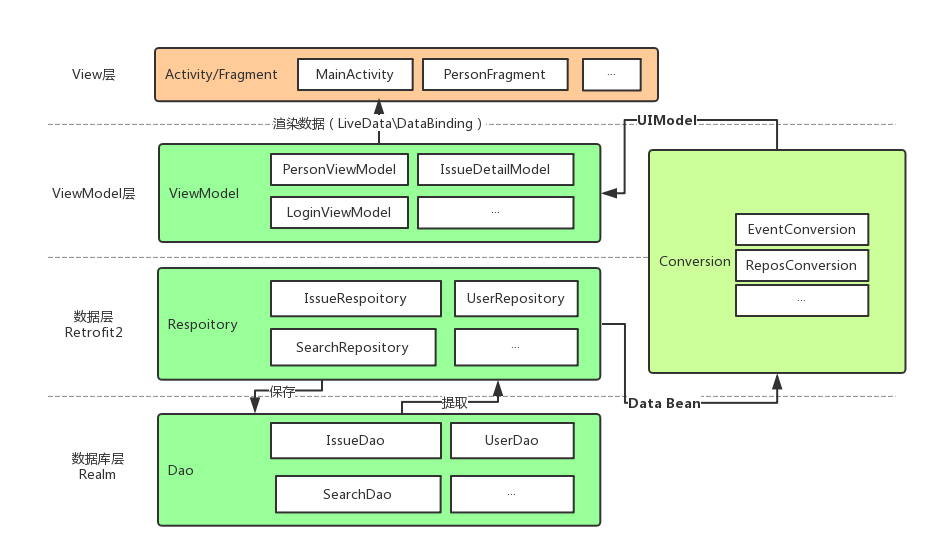

## 一款Android原生的开源Github客户端App，提供更丰富的功能，更好体验，旨在更好的日常管理和维护个人Github，提供更好更方便的驾车体验～～Σ(￣。￣ﾉ)ﾉ。项目使用`Retrofit2 + RxJava2 + Dagger2 + DataBinding + LiveData + Navigation` 等，MVVM 配合 Android JetPack，涉及各种常用控件、 `AIDL` 、 `CMake`,提供丰富的同款对比：

* ### 同款Weex版 （ https://github.com/CarGuo/GSYGithubAppWeex ）
* ### 同款ReactNative版 （ https://github.com/CarGuo/GSYGithubApp ）
* ### 同款Flutter版 （ https://github.com/CarGuo/GSYGithubAppFlutter ）
* ### [如果克隆太慢或者图片看不到，可尝试从码云地址下载](https://gitee.com/CarGuo/GSYGithubAppKotlin)

| 公众号   | 掘金     |  知乎    |  CSDN   |   简书   
|---------|---------|--------- |---------|---------|
| GSYTech  |  [点我](https://juejin.im/user/582aca2ba22b9d006b59ae68/posts)    |   [点我](https://www.zhihu.com/people/carguo)       |   [点我](https://blog.csdn.net/ZuoYueLiang)  |   [点我](https://www.jianshu.com/u/6e613846e1ea)  


```
基于 Kotlin 开发的原生 App 。目前初版，持续完善中。

项目的目的是为方便个人日常维护和查阅 Github ，更好的沉浸于码友之间的互基，Github 就是你的家。

项目同时适合 Android 和 Kotlin 的练手学习，覆盖了各种框架的使用。

随着项目的使用情况和反馈，将时不时根据更新并完善用户体验与功能优化吗，欢迎提出问题。
```
-----


## 相关文章

>敬请期待


[](https://github.com/CarGuo/GSYGithubAppKotlin/stargazers)
[](https://github.com/CarGuo/GSYGithubAppKotlin/network)
[](https://github.com/CarGuo/GSYGithubAppKotlin/issues)
[](https://github.com/CarGuo/GSYGithubAppKotlin/blob/master/LICENSE)

## 编译运行流程


> ### 重点：你需要项目根目录下，配置 `local.properties` 文件，然后输入你申请的Github client_id 和 client_secret。

    ndk.dir="xxxxxxxx"
    CLIENT_ID = "xxxxxx"
    CLIENT_SECRET = "xxxxxx"
> ### 如果需要测试 `CMake` ，要打开 Gradle 中的 `needCMakeTest` ，记得配置 [`CMake` 环境](https://blog.csdn.net/laibowon/article/details/79939962)。


   [      注册 Github APP 传送门](https://github.com/settings/applications/new)，当然，前提是你现有一个github账号(～￣▽￣)～ 。
 
### 3、现在 Github API 需要使用安全登录（授权登录），那么在上述注册 Github App 的 Authorization callback URL 一栏必须填入 `gsygithubapp://authed`

<div>


</div>


## 项目结构图




## 下载

#### Apk下载链接： [Apk下载链接](https://www.pgyer.com/XGtw)


#### Apk二维码


### 常见问题


>敬请期待


### 示例图片


### 第三方框架

| 库                       | 功能                      |
| ----------------------- | ----------------------- |
| **retrofit2**           | **网络**                  |
| **okHttp3**             | **网络**                  |
| **rxJava2**             | **异步事件处理**              |
| **dagger2**             | **依赖注入**                |
| **dataBinding**         | **数据绑定**                |
| **liveData/viewModel**  | **数据订阅**                |
| **navigation**          | **Android JetPack 导航**  |
| **aRouter**             | **组件化路由**               |
| **glide**               | **图片加载**                |
| **realm**               | **数据库**                 |
| **iconics**             | **矢量图标**                |
| **navigationtabbar**    | **TabBar**              |
| **lazyRecyclerAdapter** | **通用绑定RecyclerView适配器** |
| **markdownView**        | **Markdown解析**          |
| **prism4j**             | **代码高亮**                |
| **materialDrawer**      | **drawer**              |
| **lottie**              | **svg动画**               |
| **gson**                | **json解析**              |

### 进行中：

[版本更新说明](https://github.com/CarGuo/GSYGithubAppKotlin/blob/master/VERSION.md)


### 其他推荐

* [ThirtyDegreesRay/OpenHub](https://github.com/ThirtyDegreesRay/OpenHub) : 基于 Java + Retrofit + RxJava + MVP 的开源 github app（本项目的部分数据实体是从 OpenHub 拷贝而来。）


### LICENSE
```
CarGuo/GSYGithubAppFlutter is licensed under the
Apache License 2.0

A permissive license whose main conditions require preservation of copyright and license notices.
Contributors provide an express grant of patent rights.
Licensed works, modifications, and larger works may be distributed under different terms and without source code.
```


